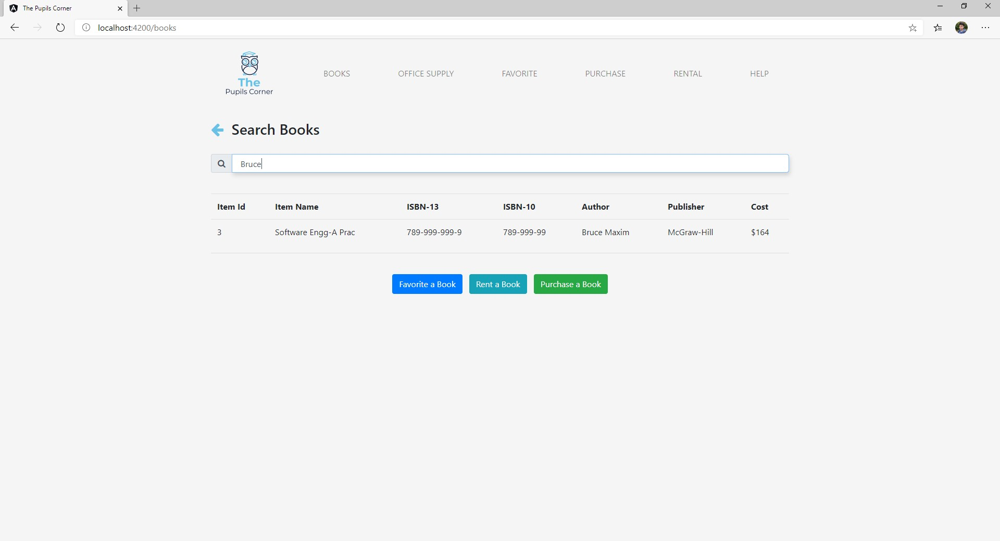

# Welcome to The Pupils Corner!
This is a group project for CIS 421 - Database Systems, taught by Dr. Raed Almomani at University of Michigan.

## Getting Started
I searched and figured out to create a RESTful backend for our Web Project, using ExpressJs as backend connected to SQL Server database. The frontend would be in Angular.

### TOOLS:
1. SQL Server Express 2019 Developer
2. SQL Server Management System
3. Node Package Manager
4. Postman (For testing database)
5. VS Code (An IDE for coding)

### STEPS FOR BACKEND:
1. Download and install the software.
2. Browse to "./Backend/." and type 'npm install' on the PowerShell.
3. Open SSMS to configure the user & password for localhost
- Login to SSMS by entering server name as 'localhost' and select 'Windows Authentication' as authentication
- Right-click on the localhost database and click Properties
- On the left pane, click Security and select the radio button saying 'SQL Server and Windows ... ' and click OK.
- Back on SSMS, on the left pane, expand Security> Logins> and right click on 'sa' and click Properties
- Modify the password and click Save
4. Press Win+S and look for SQL Server Configuration Manager 2019 and open it.
5. On left pane, expand SQL Server Network Configuration and click on Protocols for MSSQLSERVER.
6. Enable all the three services (Shared Memory, TCP/IP and Pipes)
7. On left pane, click SQL Server Services and restart the SQL Server (MSSQLSERVER) services
>  **TIP:** Maybe a system restart preferable
8. Close and re-open SSMS and login using:
- The server name is 'localhost'
- But authentication method is 'SQL Server Authentication' now.
- Type username as 'sa' and the password.
- Connect
9. On the left pane expand Databases and create a new database 'thepupilscorner'.
10. Under this database, use the DML.sql file to create tables in this database.
11. Now use the DML.sql file to insert sample data to the database. Try some queries here!
12. Open the VS Code in the './Backend/' folder
13. Open server.js, modify the user and password in dbConfig variable
14. Use the integrated terminal in VS Code and type 'npm start' in the prompt.
15. You can open Postman and try HTTP requests
- GET: localhost:8080/api/book
- POST: localhost:8080/api/book [Body: {ItemName: "", ... }]
- PUT: localhost:8080/api/book/{id} [Body: {ItemName: "", ...}]
- DELETE: localhost:8080/api/book/{id}
16. So far I remember that followed the steps above to make it work, if it won't work for you, feel free to ask me.

### STEPS FOR FRONTEND:
1. Clone the code
2. Browse to the "./FrontEnd/." and open the directory in VS Code.
3. In the Integrated Terminal, enter 'npm install'
4. After installation enter 'npm start' in the prompt
5. Navigate to 'localhost:4200'
6. Browse! Let me know if you have any questions for me. I'd be glad to help!

# Screenshots

 Sample Database Instance

 Home Page

 If you click on User from Home page, this page is displayed

 If you click on Books from User page, this page is displayed

 **DEMO** Search working for Book(s)

 If you click on Office Supply from User page, this page is displayed

 **DEMO** Search working for Office Supply(s)

 If you click on Employee from the Home page, this page is displayed
